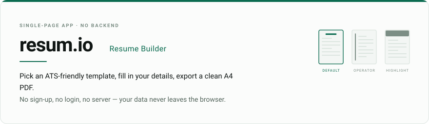
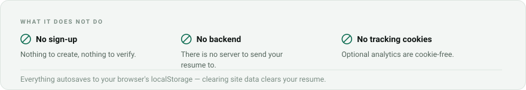
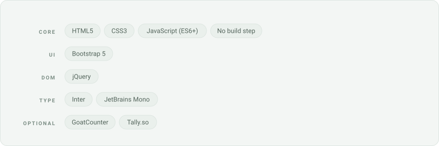

<picture>
  <source media="(prefers-color-scheme: dark)" srcset="assets/hero-dark.svg">
  <source media="(prefers-color-scheme: light)" srcset="assets/hero-light.svg">
  
</picture>

<a href="https://resume.itsmebryle.com/">
  <picture>
    <source media="(prefers-color-scheme: dark)" srcset="assets/btn-live-dark.svg">
    <source media="(prefers-color-scheme: light)" srcset="assets/btn-live-light.svg">
    
  </picture>
</a>
<a href="https://itsmebryle.com">
  <picture>
    <source media="(prefers-color-scheme: dark)" srcset="assets/btn-site-dark.svg">
    <source media="(prefers-color-scheme: light)" srcset="assets/btn-site-light.svg">
    
  </picture>
</a>

<picture>
  <source media="(prefers-color-scheme: dark)" srcset="assets/privacy-dark.svg">
  <source media="(prefers-color-scheme: light)" srcset="assets/privacy-light.svg">
  
   
</picture>

## Preview

|                                                           Desktop Editor & Live Preview                                                           |                                                           Mobile Preview Overlay                                                            |
| :-----------------------------------------------------------------------------------------------------------------------------------------------: | :-----------------------------------------------------------------------------------------------------------------------------------------: |
|  |  |

## Features

- **3 ATS-friendly templates** — Choose between _Default_, _Operator_, and _Highlight_. Built with a single-column, semantic layout under the hood to ensure top compatibility with Applicant Tracking Systems.
- **Live split preview** — Real-time rendering as you type, with a dual-panel desktop editor and a full-screen mobile overlay preview.
- **Guided sample content** — Starts with a realistic dummy resume. The instant you type into any field, sample text disappears automatically. Empty sections present dashed editor hints that never show up on export.
- **Smart drag-and-drop reordering** — Reorder sections, experience, projects, certificates, and skill chips by dragging on desktop, or with action buttons on touch and keyboard.
- **Live resume quality score** — A completeness badge in the editor topbar checks contact validity, summary length, and bullet detail with explicit feedback. PDF export stays blocked below 70%.
- **Writing assistant** — An integrated phrase bank for drafting targeted summaries, highlight bullets, and role-specific skill sets.
- **Guided onboarding tour** — A spotlight walkthrough on first launch, replayable any time.
- **A4 PDF export** — Uses the native browser print engine (`window.print()`) with precise CSS print styling.
- **Accessible by default** — Keyboard operable, zero `axe-core` violations, focus-trapped modals, and high-contrast placeholders.
- **In-app toast and audio feedback** — Non-intrusive notifications synthesized with the Web Audio API — no external sound files loaded.

## Tech Stack

<picture>
  <source media="(prefers-color-scheme: dark)" srcset="assets/stack-dark.svg">
  <source media="(prefers-color-scheme: light)" srcset="assets/stack-light.svg">
  
</picture>

No frameworks, no bundler, no build step — the repository is the deployable artifact.
